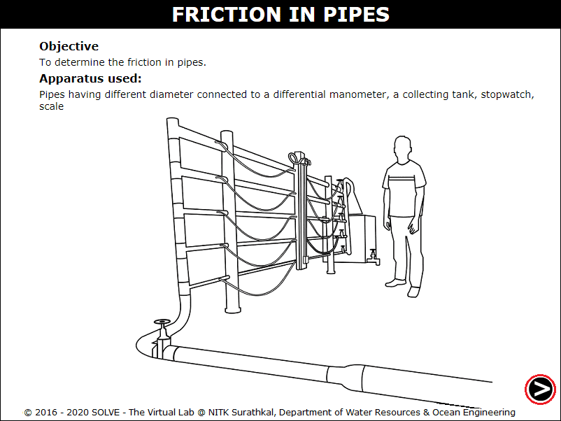
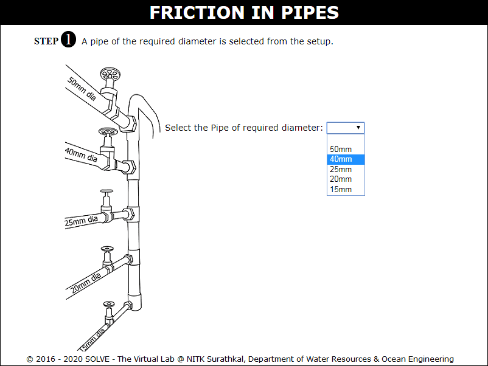
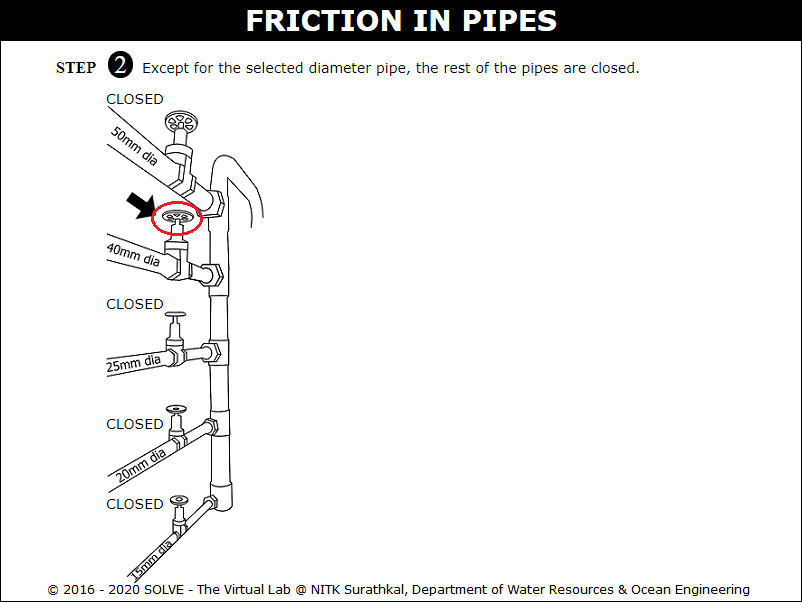
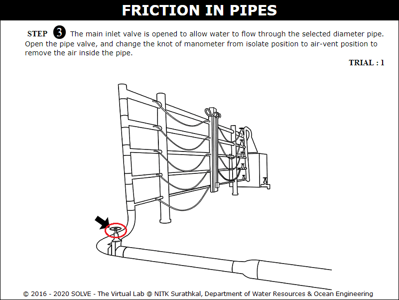
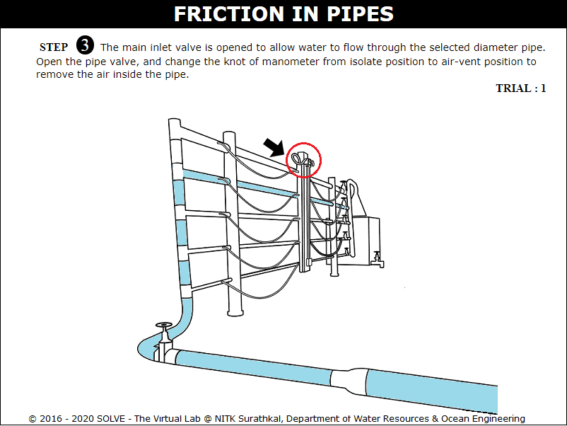
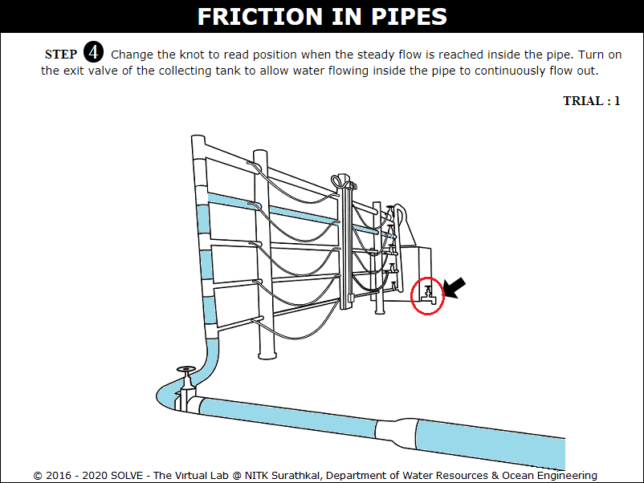
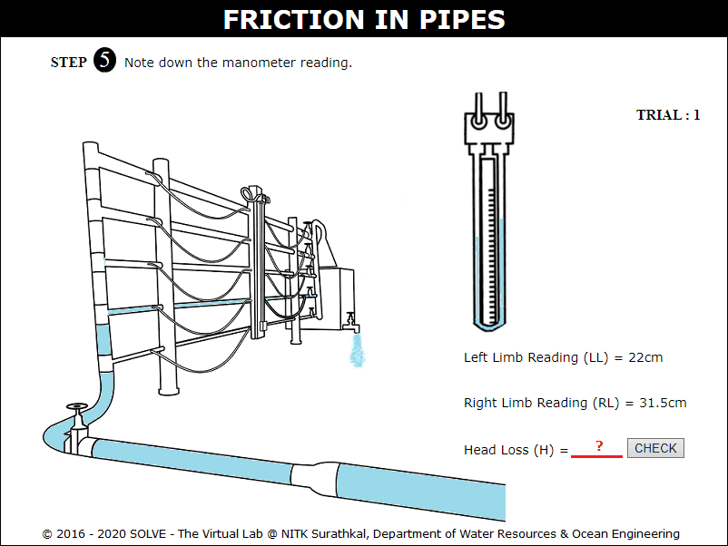
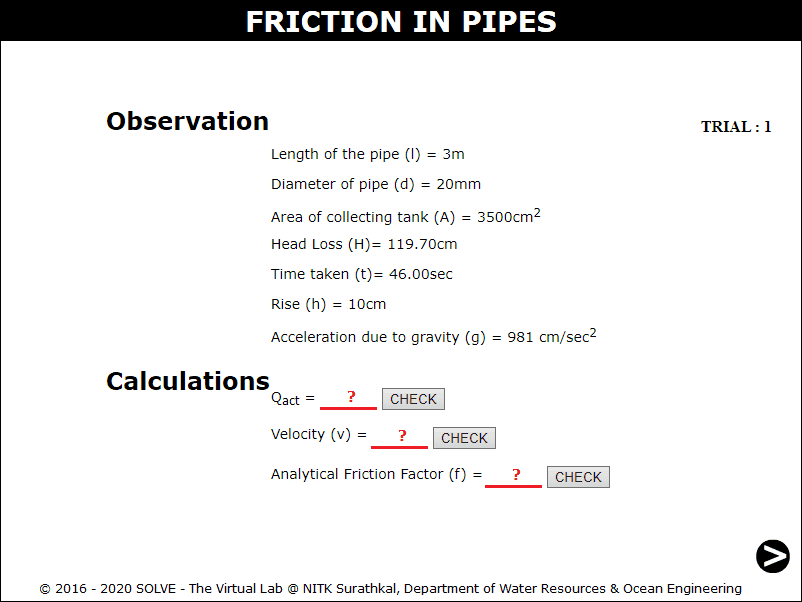

#### These procedure steps will be followed on the simulator

<ol>
<li>Open Friction in Pipes experiment, a window will appear as shown.</li>

<li>Select the required diameter of pipe, then click NEXT button.</li>

<li>Click on the selected pipe inlet valve to allow the flow through it.</li>

<li>Click on main inlet valve to allow the flow through it and then click on pipe valve to allow water flow to test for air bubbles.</li>

<li>Click on knot to change from isolated position to air-vent position and again click to change it to read position.</li>

<li>Now click on tank outlet valve to open and allow flow, note the manometer reading.</li>

<li>Here click on tank outlet valve to close and then calculate Head Loss value.</li>

<li>Calculate the discharge, velocity and analytical friction factor with the help the observation given here.</li>

<li>Repeat the same procedure for other trials.</li>
</ol>
