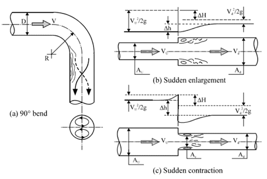
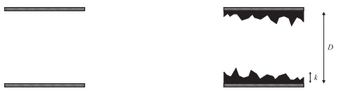
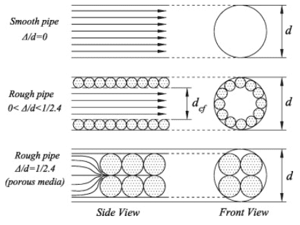
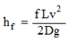
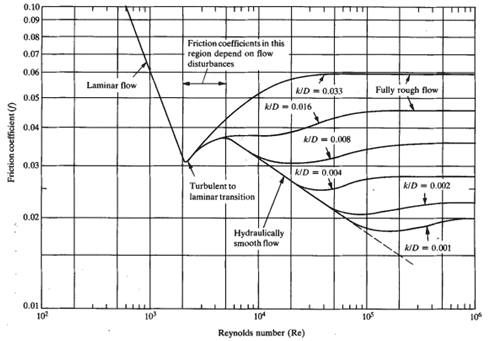

### INTRODUCTION 

When a gas or a liquid flows through a pipe, the flow of fluid through a pipe is resisted by viscous shear stresses within the fluid and the turbulence that occurs along the internal pipe wall. Due to this there will be a loss of pressure in the fluid, because energy is required to overcome the viscous or frictional forces exerted by the walls of the pipe on the moving fluid. In addition to the energy lost due to frictional forces, there will be a loss in energy when the fluid flows through fittings, such as valves, elbows, contractions and expansions. This loss in pressure is mainly due to the local flow separation as it moves through such fittings. The pressure loss in pipe flows is commonly referred to as <i><strong>head loss</strong></i>.  The frictional losses are mainly caused in a straight pipe, friction loss induced in fittings, such as bends, couplings, valves, or transitions in hose or pipe accounts for minor losses.  The frictional losses are referred to as <i><strong>major losses (hf)</strong></i> while losses through fittings, etc, are called <i><strong>minor losses (hm)</strong></i>. Together they make up the <i><strong>total head losses (h)</strong></i> for pipe flows. 

<strong>Types of fittings</strong>

In practice, loss in a pipe flow comes into picture in cases like calculation of rate of flow in the pipes connecting two reservoirs at different levels or to calculate the additional head required to double the rate of flow along an existing pipeline. These pipe losses are dependent on number of factors like viscosity of the fluid, the size of the internal pipe diameter, the internal roughness of the inner surface of the pipe, the change in elevation between the ends of the pipe, material of the pipe and the length of the pipe along which the fluid travels.

Pipes with smooth surface does not account for larger friction loss, whereas pipes with less smooth walls such as concrete, cast iron and steel fluid requires large energy to overcome the friction induced in a pipe due to the viscosity of liquid. Rougher the inner wall of the pipe, more will be the pressure loss due to friction.
 

<strong>Internal surface of smooth and rough pipes</strong>

(Source: Haung et al 2013)

#### Friction loss in pipe

The friction loss in a uniform, straight sections of pipe, known as "major loss", is caused by the effects of viscosity, the movement of fluid molecules against each other or against the (possibly rough) wall of the pipe. Here, it is greatly affected by whether the flow is laminar or turbulent.

<strong>Laminar Flow:</strong> It occurs when the fluid flows in parallel layers without adjacent mixing between the layers. In this type of flow there are neither eddies nor cross currents, with fast flow over the center part of the pipe and no movement near the pipe surface. The roughness of the pipe surface influences neither the fluid flow nor the friction loss. For laminar flow Reynolds’s number (Re) < 2100.

<strong>Turbulent Flow:</strong> It occurs when the liquid is moving fast with mixing between layers. The speed of the fluid at a point continuously undergoes changes in both magnitude and direction. For turbulent flow Reynolds's number 2100 < Re < 4000

<strong>Transitional flow: </strong> is a mixture of laminar and turbulent flow, with turbulence flow in the center of the pipe and laminar flow near the edges of the pipe. Each of these flows behaves in different manners in terms of their frictional energy loss while flowing and have different equations that predict their behaviour. For transitional flow Reynolds's number Re > 4000.

It is useful to characterize that roughness as the ratio of the roughness height k to the pipe diameter D, the "relative roughness". Three sub-domains pertain to turbulent flow:

<ul>
<li>In the smooth pipe domain, friction loss is relatively insensitive to roughness.</li>
<li>In the rough pipe domain, friction loss is dominated by the relative roughness and is insensitive to Reynolds number.</li>
<li>In the transition domain, friction loss is sensitive to both.</li>
</ul>

The Darcy Equation is a theoretical equation that predicts the frictional energy loss in a pipe based on the velocity of the fluid and the resistance due to friction. It is used almost exclusively to calculate head loss due to friction in turbulent flow.

Where,

<ul style="list-style-type:none;">
<li>hf = Friction head loss,</li>
<li>f = Darcy resistance factor,</li>
<li>L = Length of the pipe,</li>
<li>D = Pipe diameter,</li>
<li>v = Mean velocity,</li>
<li>g = acceleration due to gravity</li>
</ul>

In turbulent flow, the friction factor, f depends upon the Reynolds number and on the relative roughness of the pipe, k/D, where, k is the roughness parameter and D is the inner diameter of the pipe. When k is very small compared to the pipe diameter D i.e., k/D > 0, f depends only on Re. When k/D is a significant value, at low Re, the flow can be considered as in smooth regime (no effect of roughness). As Re increases, the flow becomes transitionally rough, called as transition regime in which the friction factor rises above the smooth value and is a function of both k and Re and Re increases more and more the flow eventually reaches a fully rough regime in which f is independent of Re. For design purposes, the frictional characteristics of round pipes, both smooth and rough are summarized by the friction factor chart, which is a log-log of fanning friction factor vs Re which is based on Moody's chart.

